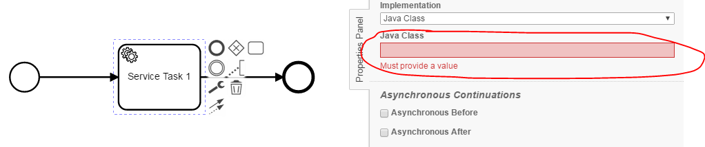
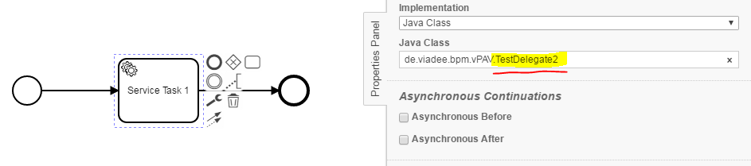
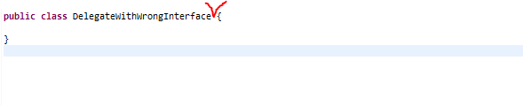

Java Delegate Checker
=================================
Using the Java Delegate Checker, process models can be used to check whether the following conditions apply to 
Service Tasks, Send Tasks, Receive Tasks, Script Tasks or Business Rule Tasks:
- No implementation specified
- Class not found, although specified as implemented
- Class doesn't implement the *JavaDelegate* interface

## Assumptions
----------------------------------------------
- The **BPMN-models** have to be in **classpath**
- The **java classes _(delegates)_** have to be in the **classpath**

## Configuration
------------------------------------------
The rule should be configured as follows:
```xml
<rule>
  <name>JavaDelegateChecker</name>
  <state>true</state>
</rule>
```

Via `<state>true</state>` the check can be enabled.

Via `<state>false</state>` the check can be disabled.

## Error messages:
-----------------------------------------
**task '%taskName%' with no code reference yet**

_No reference to source code has been deposited. An implementation must be created._

**class for task '%taskName' not found**

_A Java class has been specified that does not exist. Check whether the package-path has changed (e.g. in the context of a refactoring) or the file has been accidentally deleted._

**class for task %taskName% does not implement interface JavaDelegate**

_A Java class has been specified that doesn't implement the JavaDelegate interface. The Java class have to be changed, so that it implements the JavaDelegate interface._

## Examples
----------------------------------------

| **No implementation specified**                                                                        | 
|:------------------------------------------------------------------------------------------------------:| 
|    |
| |

| **Class specified as implementation, but not found**                                                   |
|:------------------------------------------------------------------------------------------------------:| 
|                            |
| |

| **Class does not implement the JavaDelegate interface**                                                |
|:------------------------------------------------------------------------------------------------------:| 
      |
