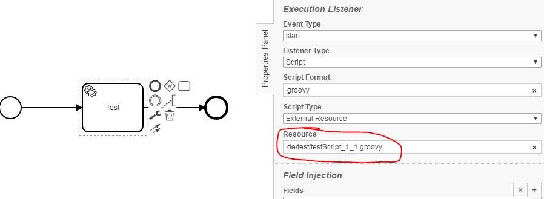
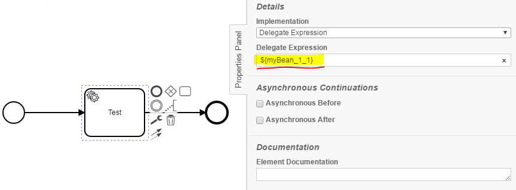

Versioning Checker
=================================
The Versioning Checker checks references in Service Tasks, Script Tasks, Business Rule Tasks, Send Tasks, Listenern and Message Events
to the declaration of a versioned java implementation.
When a versioned implementation is referenced, it is checked whether it is up-to-date.

## Assumptions
----------------------------------------------
- The **BPMN-models** have to be in **classpath**

## Configuration
------------------------------------------
The rule should be configured as follows:
```xml
<rule>
  <name>VersioningChecker</name>
  <state>true</state>
  <settings>
  	<setting name="versioningSchemaClass">([^_]*)_{1}([0-9][_][0-9]{1})\.(java|groovy)</setting>
  </settings>
 </rule>

```

Via `<state>true</state>` the check can be enabled.

Via `<state>false</state>` the check can be disabled.

The setting „versioningSchemaClass“ includes a file name scheme (regular expression) for versioned classes.
This is required for the identification of such classes, here e.g. <name>_<majorversion>_<minorversion>.jave/groovy

## Error messages
-----------------------------------------
**class reference is deprecated or file with version doesn't exist**
_A referenced Java class is deprecated or isn't versioned._
_If the referenced class is deprecated, change the reference to the current version._
_Unless a versioned class is undeposited, it must be adapted to the version name convention._

**script reference is deprecated or file with version doesn't exist**
_A referenced script is deprecated or isn't versioned._
_If the referenced script is deprecated, change the reference to the current version._
_Unless a versioned script is undeposited, it must be adapted to the version name convention._

**bean reference is deprecated or file with version doesn't exist**
_A referenced spring-bean is deprecated or isn't versioned._
_If the referenced spring-bean is deprecated, change the reference to the current version._
_Unless a versioned spring-bean is undeposited, it must be adapted to the version name convention._


## Examples
----------------------------------------

| **class reference is deprecated or file with version doesn't exist**                                   | 
|:------------------------------------------------------------------------------------------------------:| 
|                |
| |

| **script reference is deprecated or file with version doesn't exist**                                  | 
|:------------------------------------------------------------------------------------------------------:| 
|                  |
| |

| **bean reference is deprecated or file with version doesn't exist**                                    | 
|:------------------------------------------------------------------------------------------------------:| 
|                      |
| |


