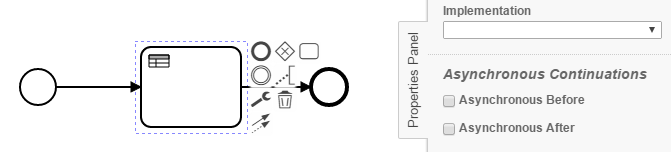
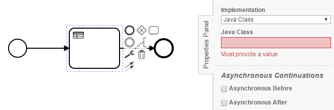
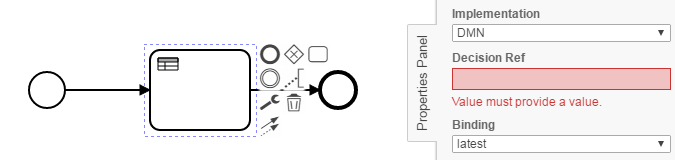

Business Rule Task Checker
=================================
The Business Rule Task Checker processes BPMN models and checks, whether the following conditions apply to Business Rule Tasks:
- No implementation specified
- Implementation without its respective reference specified
 
If a java class is referenced, the checker returns and forwards the BusinessRuleTask to the JavaDelegateChecker

## Assumptions
----------------------------------------------
- The **BPMN-models** have to be in the **classpath** at build time
- The **java classes _(delegates)_** have to be in the **classpath** at build time

## Configuration
------------------------------------------
The rule should be configured as follows:
```xml
<rule>
  <name>BusinessRuleTaskChecker</name>
  <state>true</state>
</rule>

```

## Error messages:
-----------------------------------------
**no implementation or reference has been specified for '%taskName%'**

_No implementation or reference to source code has been deposited._

## Examples
----------------------------------------

| **No implementation specified**                                                                        | 
|:------------------------------------------------------------------------------------------------------:| 
|    |
| |

| **Class specified as implementation, but not found**                                                   |
|:------------------------------------------------------------------------------------------------------:| 
|                            |
| |

| **No DMN File has been specified via decision ref**                                                |
|:------------------------------------------------------------------------------------------------------:| 
      |
